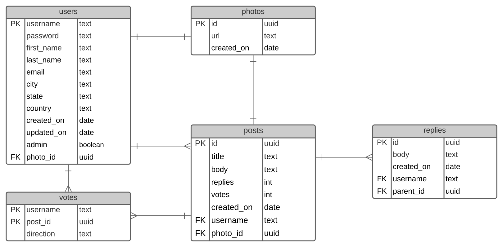

# **dogfriends**
[To: dogfriends website](https://dogfriend.frank-vasek-dev.com)

## OVERVIEW
People who own dogs need help caring for their dogs. People have to go to work, but dogs don’t like to go to work. People like to go on vacation, but dogs don’t like to fly. People don’t like to go outside when it is raining or snowing, but dogs really don’t care about the weather. People go to bars, clubs, and Internet areas to meet new friends, but dogs don’t like bars, clubs, and have no idea how to work the mouse. 

## GOALS
- A social media outlet for dog owners to socialize
- Share dog pictures / memes
- Share dog stories
- Make dog friends 

## SPECIFICATIONS
**Frontend: React, Redux**
- User signup / login
- User profile (contact information, avatar image)
- Create a message (text, photo)
- All image editing done on the client (upload as drop file or folder view, add text on image with color)
- Upload images to S3 cloud storage
- Respond to other people’s posts

**Backend API: ExpressJS, PostgreSQL, AWS Lambda Function, AWS S3 Storage**

- Authenticate users (JWT)
- Create new user
- Create posts
- Create replies
- Create image
- Read user information
- Read post data
- Read reply data
- Read image data
- Update user information
- Update post data
- Update reply data
- Update image data

**Stretch Goals**

- Delete user account
- Delete post data
- Vote functionality on posts
- Admin panel for managing site 

## Database Design

## Data Infrastructure

---
This project was bootstrapped with [Create React App](https://github.com/facebook/create-react-app), using the [Redux](https://redux.js.org/) and [Redux Toolkit](https://redux-toolkit.js.org/) template.

## Available Scripts

In the project directory, you can run:

### `npm start`

Runs the app in the development mode. 
Open [http://localhost:3000](http://localhost:3000) to view it in the browser.

The page will reload if you make edits. 
You will also see any lint errors in the console.

### `npm test`

Launches the test runner in the interactive watch mode. 
See the section about [running tests](https://facebook.github.io/create-react-app/docs/running-tests) for more information.

### `npm run build`

Builds the app for production to the `build` folder. 
It correctly bundles React in production mode and optimizes the build for the best performance.

The build is minified and the filenames include the hashes. 
Your app is ready to be deployed!

See the section about [deployment](https://facebook.github.io/create-react-app/docs/deployment) for more information.

### `npm run eject`

**Note: this is a one-way operation. Once you `eject`, you can’t go back!**

If you aren’t satisfied with the build tool and configuration choices, you can `eject` at any time. This command will remove the single build dependency from your project.

Instead, it will copy all the configuration files and the transitive dependencies (Webpack, Babel, ESLint, etc) right into your project so you have full control over them. All of the commands except `eject` will still work, but they will point to the copied scripts so you can tweak them. At this point you’re on your own.

You don’t have to ever use `eject`. The curated feature set is suitable for small and middle deployments, and you shouldn’t feel obligated to use this feature. However we understand that this tool wouldn’t be useful if you couldn’t customize it when you are ready for it.

## Learn More

You can learn more in the [Create React App documentation](https://facebook.github.io/create-react-app/docs/getting-started).

To learn React, check out the [React documentation](https://reactjs.org/).

### Code Splitting

This section has moved here: https://facebook.github.io/create-react-app/docs/code-splitting

### Analyzing the Bundle Size

This section has moved here: https://facebook.github.io/create-react-app/docs/analyzing-the-bundle-size

### Making a Progressive Web App

This section has moved here: https://facebook.github.io/create-react-app/docs/making-a-progressive-web-app

### Advanced Configuration

This section has moved here: https://facebook.github.io/create-react-app/docs/advanced-configuration

### Deployment

This section has moved here: https://facebook.github.io/create-react-app/docs/deployment

### `npm run build` fails to minify

This section has moved here: https://facebook.github.io/create-react-app/docs/troubleshooting#npm-run-build-fails-to-minify
